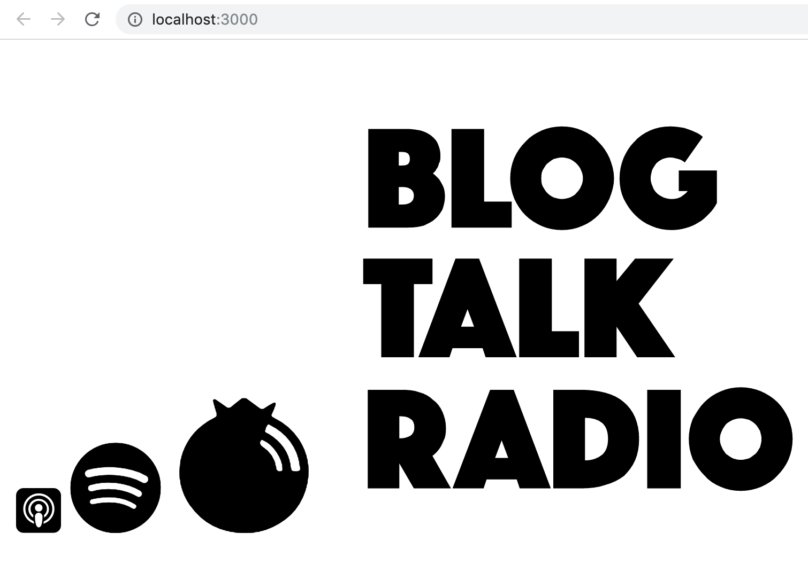

# react-podfonts

Font Icons for Podcasters.

For more info and a list of all available icons, visit: [podfonts.com](https://podfonts.com)

## How to install

```bash
npm i react-podfonts
```

## How to use

```jsx
import React from 'react'
import Podfont from 'react-podfonts'

const App = props =>
  <div>
    <Podfont size='1x' icon="apple-podcasts" />
    <Podfont size='2x' app icon="spotify" />
    <Podfont size='3x'  host icon="blubrry" />
    <Podfont size='10x' host icon="blog-talk-radio" />
  <div>

export default App
```

By default, the `<Podfont>` component will default to `app` icons. To use a `host` icons, just add the `host` prop as shown in the example.



For a list of available icons, visit: [podfonts.com](https://podfonts.com)
